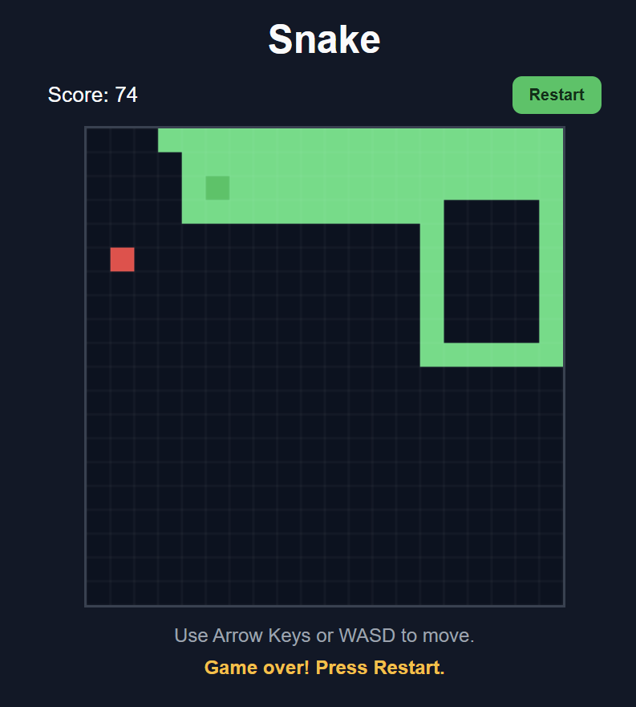
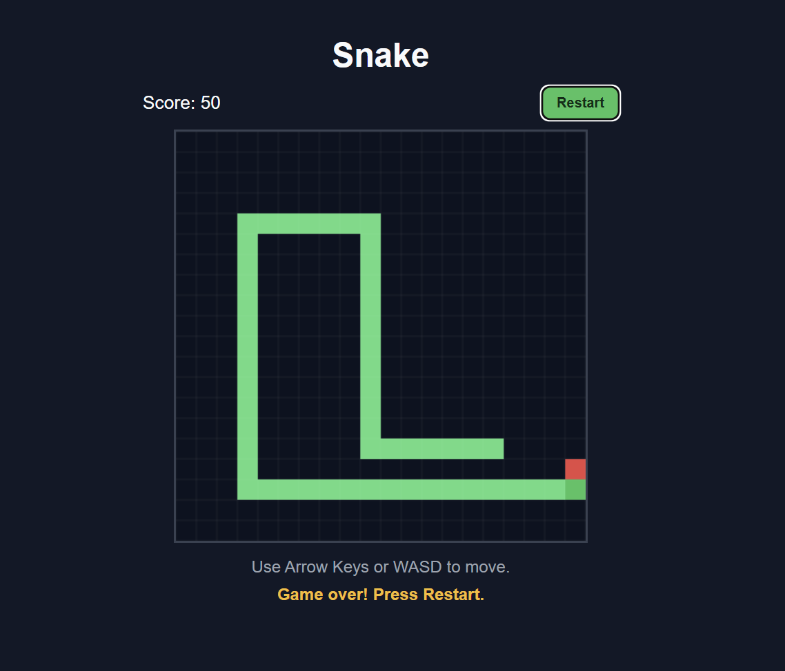

## 哈喽，我是一名新手开发者

### 我参与过的项目
- 安卓软件LinusFocus的独立开发（该项目已中止）
- 一个多Agent系统的TUI框架设计和Agent开发与集成

### 我正在参与的项目
- 一辆智能小车的机械设计、PCB绘制和STM32编程
- 桌面软件Lidesk的独立开发

### 我计划开展的项目
- 一个机器人方向的项目
- 一个笔记软件项目

### 我接触过的语言（按熟练程度排序）
- Python
- C/C++
- HTML/CSS
- JavaScript
- Dart

### 我会使用的设计类软件（按熟练程度排序）
- SolidWorks
- AutoCAD
- LCEDA
- NX
- Unity Hub

### 我喜欢做的其他事情
- 打架子鼓
- 写点东西
- 喝啤酒

### 我参加过的这些项目虽然杂，但是让我看见了自己的可能性。

### 如果有有趣的事情，或者你对我在做/计划做的事情感兴趣，欢迎联系 lenocai@foxmail.com :)

### 这是我写的一些文章

- [对现代社会和主体性的一些小思考 (4.8.2026)](assets/articles/article1.md)

### 你也可以玩一玩我用Cursor写的的贪吃蛇小游戏

[SnakeGame](https://Lineus.github.io/SnakeGame/)    
贪吃蛇排行榜（排行榜还是手动更新，如果想上榜得发我邮箱）    
1.SixPigs     
   
2.豪闯天下    
    

<picture>
  <!-- 深色主题专用效果 -->
  <source media="(prefers-color-scheme: dark)" srcset="https://pixel-profile.vercel.app/api/github-stats?username=Lineus&screen_effect=false&theme=blue_chill">
  <!-- 浅色主题专用效果 -->
  
</picture>

